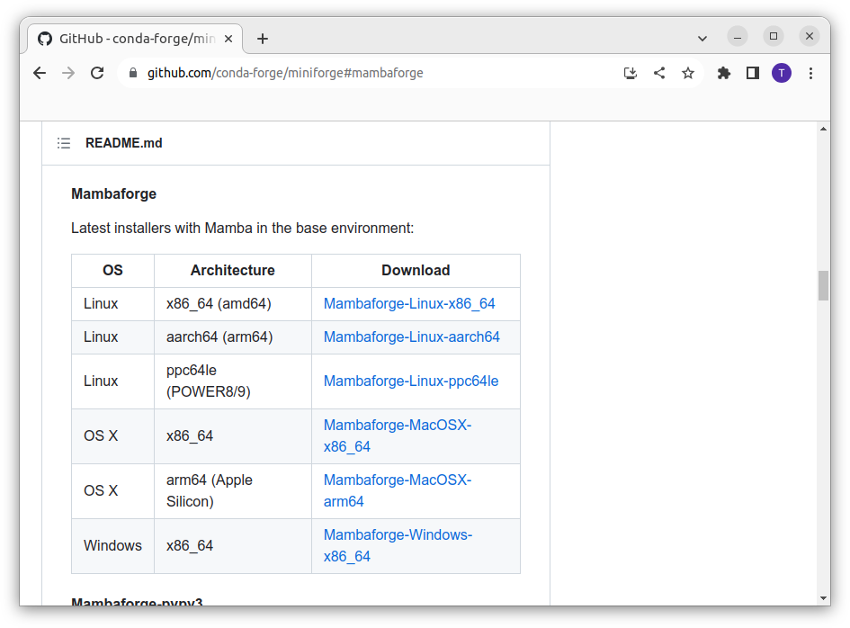
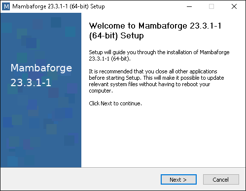
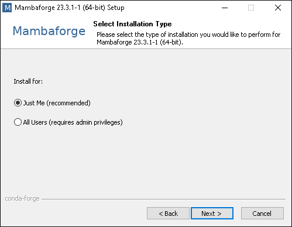
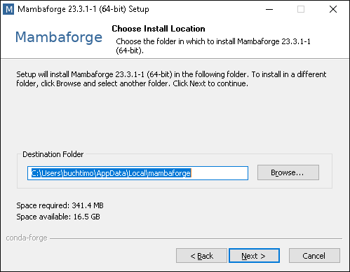
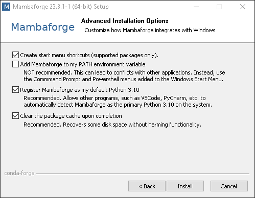
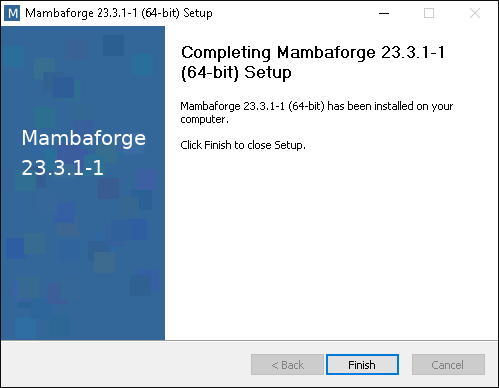
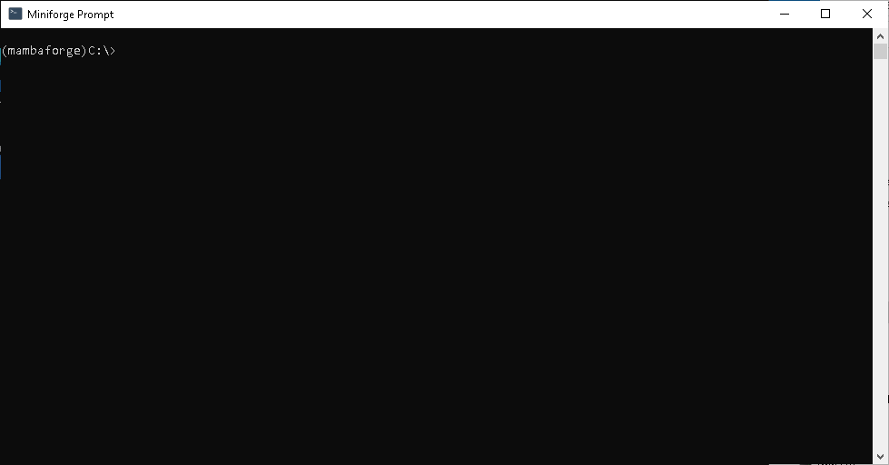
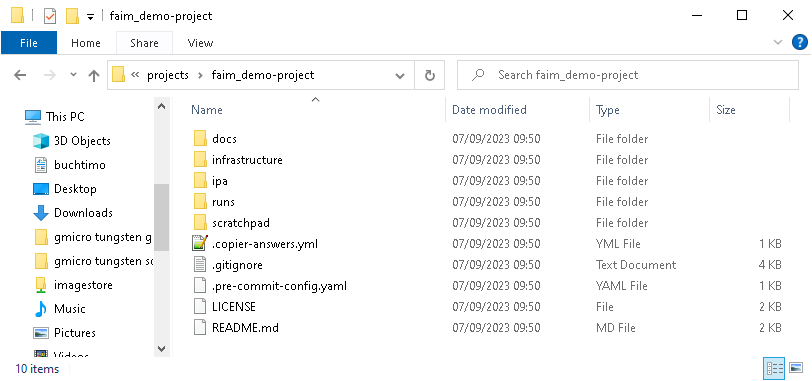

# Installation Guide
This page covers the whole process of setting up a new image processing and analysis project.
We first start by installing [Mambaforge](https://github.com/conda-forge/miniforge) as our package manager.
Then we will create a copy of this IPA template and guide you through the first steps with your freshly created project.

## Mamba & Python
Python is a populare programming language which is easy to learn and is used by many for their scientif data analysis.

Mamba is an environment manager which we use to install Python packages. In essence it is a programm that helps us installing programs. More about the mamba concepts can be found [here](https://mamba.readthedocs.io/en/latest/user_guide/concepts.html#concepts).

### Installing Mambaforge
[Mambaforge](https://github.com/conda-forge/miniforge) is a minimal installer using mamba and pre-configured to use [conda-forge](https://conda-forge.org/) as package source. Conda-forge is a community driven Python package provider.


```{tab} Windows
First, download the latest version of mambaforge for Windows from [here](https://github.com/conda-forge/miniforge#mambaforge):



Start the installer and follow the instructions.

Click `Next >`:



Click `I Agree`:


Select `Just Me (recommended)` and click `Next >`:



Keep the default `Destination Folder` and click `Next >`:



Select options 1), 3), and 4) and click `Next >`:



The installation has finished. Click `Next >`:


Click `Finish` to close the installer:



To start mambaforge search for `Miniforge Prompt` (yes, Miniforge) in your Windows search bar and click it to start the prompt:



You are now in the base environment. Do __not__ install anything into the base environment. It can break your whole setup and you would have to start all over again.
```


```{tab} Mac
Open a new `Terminal` by typing `Terminal` in your spotlight search.

Run the following command to download the latest release:

    curl -L -O "https://github.com/conda-forge/miniforge/releases/latest/download/Mambaforge-$(uname)-$(uname -m).sh"

And this command to install it on your machine:

    bash Mambaforge-$(uname)-$(uname -m).sh


```

## Copy template
```{note}
From now on we work inside the `Miniforge Prompt` or `Terminal` which has mamba installed.
The screenshots are from the `Miniforge Prompt` on Windows.
```

Copier is a command line tool and we first want to install it into its own environment. For this we copy-paste the following command into our open terminal:

```bash
mamba create -n copier-env -y python=3.9 copier -c conda-forge
```

Once this command has completed, we can activate the environment with:

```bash
mamba activate copier-env
```


```{note}
The prefix of your command line prompt is now `copier-env` indicating that your are working inside the active environment.
```

Before we start the copier process we want to navigate to the parent directory where we want to setup our project space.
In my case this is `C:\Users\buchtimo\projects`:

```bash
cd Users\buchtimo\projects
```

Now we can start the copier process:

```bash
copier copy git+https://github.com/fmi-faim/ipa-project-template faim_demo-project
```


After completion of the copy process we want to deactivate the `copier-env` and change into the newly created project directory.

```bash
mamba deactivate
cd faim_demo-project
```

You can also open the directory in your `File Explorer` or `Finder`:



A detailed description of the individual files and directory can be found in [IPA Project Structure](ipa_structure.md).

## Build Python IPA Environment
Now that we have our newly copied image processing and anlysis project we want to create our first Python environment which comes with some useful packages for image processing already installed.
With mamba we can use so-called environment yaml files which contain a list of packages we want to install.
In our new project we have such a file in `infrastructure/env-yamls/demo-project-env.yaml` with the following content:

```yaml
name: demo-project              # The default name of the environment.
channels:
  - conda-forge                 # Source of the packages.
dependencies:
  - python=3.9                  # Here we want to use Python version 3.9
  - pydantic=1.10.10            # The package pydantic is fix to version 1.10.10
  - pyyaml
  - scikit-image                # From scikit-image we want to get the latest version.
  - numpy<1.25
  - tifffile
  - pandas
  - aicsimageio[all]
  - bioformats_jar
  - matplotlib
  - tqdm
  - iprogress
  - ipywidgets
  - questionary
  - jupyter
  - stackview
  - sphinx
  - furo
  - myst-parser
  - sphinx-inline-tabs
  - sphinx-copybutton
  - pre-commit
```

To build this environment we run the following command in our `Miniforge Prompt` or `Terminal`:

```bash
mamba env create -f infrastructure/env-yamls/demo-project-env.yaml
```

Follow the instructions and wait until the process has completed.
Then you can activate the environemtn with:

```bash
mamba activate demo-project
```

```{note}
You can find these instructions with the exact commands for your project in `infrastructure/README.md`.
```
